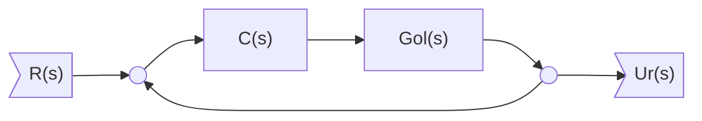

Possibile intervenire su retroazione per stabilizzare $G_{s}$ (o aumentare i margini di stabilità).

$\downarrow \downarrow$ Guadagno Statico $\rightarrow$ $\downarrow \downarrow$ Precisione

Una via alternativa è quella di bilanciare la reazione, intervenendo sui poli)

